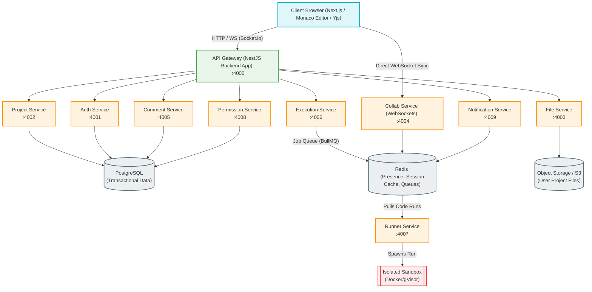

# Codex2: System Architecture Design

This document details the system-level design, component breakdown, and communication protocols of **Codex2**. It serves as the architectural blueprint for the development team.

---

## 🛠️ High-Level System Architecture

Codex2 is designed as a modular microservices architecture, built on top of an **Nx Monorepo**. This structure ensures clear boundaries, independent scalability, and tech-stack flexibility for each component.



---

## 📦 Microservices Breakdown

### 1. API Gateway (`backend`) — Port 4000
Acts as the single entry point for client applications. It handles:
*   Reverse-proxying HTTP and WebSocket connections to target microservices.
*   Request sanitization, payload size checking, and SSL/TLS termination.
*   Rate limiting (using `@nestjs/throttler`) to prevent Denial of Service (DoS) attacks.
*   Unified JWT decoding and validation before passing requests down to downstream services.

### 2. Auth Service — Port 4001
Manages identity and access verification:
*   Registration, authentication (JWT), session verification, and OAuth2 integration (GitHub, Google).
*   Password hashing (Argon2) and credential management.
*   Session storage lifecycle.

### 3. Project Service — Port 4002
Handles workspace project lifecycle metadata:
*   Project CRUD (Creation, Read, Update, Deletion) operations.
*   Workspace workspace environment configurations (specifying runtime languages, packages, environment variables).
*   Inviting collaborators to a project.

### 4. File Service — Port 4003
Governs project files and folders:
*   Compiles folders and files into a flat or nested tree JSON format.
*   Stores and retrieves file contents from S3 Object Storage or a Persistent local volume.
*   File versioning, locking, and synchronization logs.

### 5. Collab Service — Port 4004
Powers real-time multi-user editing:
*   Maintains continuous WebSocket connections (`socket.io` or raw WebSockets).
*   Integrates with **Yjs** (CRDT protocol) to synchronize document modifications collision-free.
*   Tracks user cursors and presence details, broadcasting them to active editors in the same project workspace.

### 6. Comment Service — Port 4005
Allows code discussions:
*   Inline comment indexing (associated with a specific file path, starting/ending line index, and column index).
*   Threaded replies and conversation resolution.
*   Mention parser (e.g., `@username`) to flag specific users.

### 7. Execution Service — Port 4006
Handles execution jobs orchestrations:
*   Validates user compile/run requests (verifying languages and project structure).
*   Enqueues code run tasks into a **Redis Queue** (using BullMQ) to handle server load surges.
*   Monitors execution state and pipes output streams back to the gateway.

### 8. Runner Service — Port 4007
Executes arbitrary developer code safely. Details on security are located in the [Execution Security](#runner-service-sandboxing--security) section.
*   Listens to execution jobs from the Redis Queue.
*   Spawns execution containers, transfers code, runs compilation/interpreters.
*   Streams standard output (`stdout`), standard error (`stderr`), and exit codes back.

### 9. Permission Service — Port 4008
Manages fine-grained authorization policies:
*   Maintains the Role-Based Access Control (RBAC) and Access Control List (ACL) configurations.
*   Validates if a user has sufficient rights (`Read`, `Write`, `Admin`, `Execute`) before a command is handled by other services.

### 10. Notification Service — Port 4009
Direct alert dispatcher:
*   Receives system-wide events via Redis Pub/Sub (e.g., collaborative project invitation, execution failure, comment mention).
*   Dispatches web push notifications, in-app WebSocket messages, or emails.

---

## 📡 Communication Protocols

1.  **Client-to-Gateway:** HTTPS / WSS (REST APIs for CRUD/Auth, WebSockets for Collaboration and terminal streams).
2.  **Internal Service-to-Service:**
    *   **Synchronous RPCs:** NestJS Microservices TCP/gRPC transport layer for high-throughput, low-latency calls (e.g., File service calling Permission service).
    *   **Asynchronous Events:** Redis Pub/Sub or RabbitMQ for broadcasting loose system alerts (e.g., project modifications alerting the notification service).
    *   **Distributed Task Queue:** Redis (BullMQ) for buffering code execution tasks handled by the Runner Service.

---

## 💾 Storage Layer Design

*   **Relational Database (PostgreSQL):** Used by Auth, Project, Comment, and Permission services. Houses user records, project profiles, folder structures, comments, and permissions. Database schema queries are managed via **Prisma ORM**.
*   **Object Storage (AWS S3 / MinIO):** Used by the File Service to store the raw source code files and assets safely.
*   **In-Memory Store (Redis):** Serves as:
    1.  WebSocket presence repository (tracking who is actively looking at what project).
    2.  BullMQ broker hosting the execution task lists.
    3.  Session database caching authenticated tokens.

---

## 🔒 Runner Service Sandboxing & Security

Executing untrusted user code poses critical security risks (resource exhaustion, system hijacking, network intrusion). Codex2 solves this through a multi-layered sandbox runtime:

```text
+-----------------------------------------------------------+
| Runner Service (Node/NestJS Orchestrator)                 |
|  - Pulls job, downloads code, mounts files                |
|  - Limits Execution Time: Max 15 seconds                  |
+-----------------------------------------------------------+
                              | Spawns runtime environment
                              v
+-----------------------------------------------------------+
| Sandbox Layer (gVisor runsc / Kata Containers)           |
|  - Replaces default Docker runc runtime                   |
|  - Intercepts and filters Linux system calls              |
+-----------------------------------------------------------+
                              | Runs guest kernel
                              v
+-----------------------------------------------------------+
| Isolated Runtime Sandbox (Docker Container)               |
|  - Read-Only root filesystem                              |
|  - Resource limits: CPU max 0.5 cores, Mem max 256MB      |
|  - Zero internet connectivity (Blocked Network bridge)     |
|  - User Namespace: Maps root within container to nobody    |
+-----------------------------------------------------------+
```

1.  **Runtime Interception (gVisor/Firecracker):** Instead of using standard Docker (`runc`), the runner service initiates containers using **gVisor** (`runsc`). gVisor runs a user-space kernel that intercepts and sanitizes dangerous system calls, shielding the host OS kernel.
2.  **Resource Limits (cgroups):** Strict constraints are set per code run:
    *   *CPU Limit:* Max 0.5 CPU core.
    *   *Memory Limit:* Max 256MB RAM.
    *   *Process Limit:* Max 30 simultaneous process threads (preventing fork-bombs).
    *   *Time Limits:* Code is hard-killed after 15 seconds of execution.
3.  **Network Isolation:** Sandboxes are run with the `--network none` flag. Untrusted code cannot perform outgoing curl requests, email spamming, or local network port scanning.
4.  **Filesystem Isolation:** The container has a read-only root system. Code is placed inside a small, dedicated tempfs folder which is destroyed immediately after execution.
