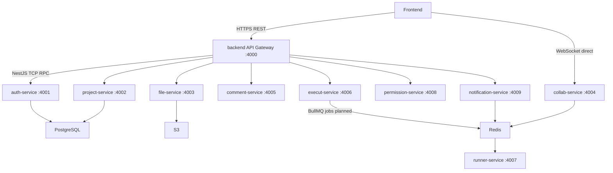

# Microservices Connection Guide

This document explains how all Codex2 backend microservices connect, which protocols they use, and why those choices were made. For service responsibilities and folder layout, see [README.md](./README.md).

---

## Architecture Overview



The **API gateway** (`apps/backend`, port 4000) is the only HTTP entry point for REST clients. Downstream domain services listen on **NestJS TCP microservice** ports 4001–4009. The gateway forwards requests using `ClientProxy.send()` with typed `{ cmd: '...' }` message patterns.

---

## Service Catalog

| Service | App folder | Port env var | Default port | Role | Connects to |
|---------|------------|--------------|--------------|------|-------------|
| API Gateway | `apps/backend` | `PORT` | 4000 | Single REST entry, JWT validation, routing | All downstream TCP services |
| Auth | `apps/auth-service` | `AUTH_SERVICE_PORT` | 4001 | Login, registration, JWT | Gateway (TCP), PostgreSQL (planned) |
| Project | `apps/project-service` | `PROJECT_SERVICE_PORT` | 4002 | Workspaces and project metadata | Gateway (TCP), PostgreSQL (planned) |
| File | `apps/file-service` | `FILE_SERVICE_PORT` | 4003 | File tree and source storage | Gateway (TCP), S3/MinIO (planned) |
| Collab | `apps/collab-service` | `COLLAB_SERVICE_PORT` | 4004 | WebSocket Yjs real-time sync | Gateway (TCP), clients (WebSocket direct), Redis (planned) |
| Comment | `apps/comment-service` | `COMMENT_SERVICE_PORT` | 4005 | Threaded comments and @mentions | Gateway (TCP), PostgreSQL (planned) |
| Execut | `apps/execut-service` | `EXECUT_SERVICE_PORT` | 4006 | Execution job ingestion | Gateway (TCP), Redis/BullMQ (planned) |
| Runner | `apps/runner-service` | `RUNNER_SERVICE_PORT` | 4007 | Sandboxed code execution | Redis/BullMQ (planned), Docker/gVisor (planned) |
| Permission | `apps/permission-service` | `PERMISSION_SERVICE_PORT` | 4008 | RBAC and ACL checks | Gateway (TCP), PostgreSQL (planned) |
| Notification | `apps/notification-service` | `NOTIFICATION_SERVICE_PORT` | 4009 | Alerts and push notifications | Gateway (TCP), Redis pub/sub (planned) |

Each service also has a `*_SERVICE_HOST` env var (default `localhost`) used by the gateway when registering TCP clients.

---

## Why This Architecture

| Layer | Protocol | Why |
|-------|----------|-----|
| Client → Gateway | HTTP/REST | One public entry point for TLS termination, rate limiting, request validation, and unified JWT handling before traffic reaches internal services. |
| Client → Collab | WebSocket (direct) | Real-time Yjs document sync needs low latency; proxying through the gateway adds an unnecessary hop and complicates long-lived connections. |
| Gateway → Services | NestJS TCP microservices | Fast internal RPC with typed command patterns (`{ cmd: 'auth.login' }`); no HTTP parsing overhead between services; fits NestJS `ClientsModule` / `@MessagePattern` natively. |
| Execut → Runner | BullMQ on Redis (planned) | Code execution is slow and untrusted; an async job queue decouples the request path from sandbox startup and allows backpressure and retries. |
| Notification / Collab | Redis pub/sub (planned) | Event fan-out (mentions, invites) without synchronous coupling between publishers and subscribers. |
| Auth, Project, Comment, Permission | PostgreSQL (planned) | Shared transactional data with ACID guarantees for users, projects, comments, and policies. |
| File | S3/MinIO (planned) | Object storage scales independently from compute; suitable for large source files and binary assets. |

---

## Connection Patterns

### A. Gateway client registration

Injection tokens and TCP targets are defined in `apps/backend/src/microservices/constants.ts`. The gateway registers all nine downstream clients via `ClientsModule`:

```typescript
ClientsModule.register([
  {
    name: AUTH_SERVICE,
    transport: Transport.TCP,
    options: {
      host: process.env.AUTH_SERVICE_HOST ?? 'localhost',
      port: Number(process.env.AUTH_SERVICE_PORT) || 4001,
    },
  },
  // ... project, file, collab, comment, execut, runner, permission, notification
])
```

**Why:** Central configuration keeps host/port mapping in one place; controllers inject clients by token without hardcoding addresses.

### B. Gateway HTTP → microservice RPC

The gateway exposes REST endpoints and forwards to TCP handlers:

```typescript
@Inject(AUTH_SERVICE) private readonly authClient: ClientProxy

return firstValueFrom(
  this.authClient.send({ cmd: 'auth.login' }, body),
);
```

**Why:** Clients speak HTTP; internal services speak TCP RPC. The gateway translates between them.

### C. Service TCP bootstrap

Each domain service starts a TCP microservice listener in `main.ts`:

```typescript
const app = await NestFactory.create(AuthServiceModule);
const port = Number(process.env.AUTH_SERVICE_PORT) || 4001;

app.connectMicroservice({
  transport: Transport.TCP,
  options: { host: '0.0.0.0', port },
});

await app.startAllMicroservices();
```

**Why:** Services bind TCP on their configured port and accept `MessagePattern` RPC calls from the gateway. HTTP `app.listen()` is not used on domain services so the same port is not shared between HTTP and TCP.

### D. Service message handlers

Handlers respond to typed commands:

```typescript
@MessagePattern({ cmd: 'service.health' })
health() {
  return { service: 'auth-service', status: 'ok', port: 4001 };
}

@MessagePattern({ cmd: 'auth.login' })
login(@Payload() data: { email: string; password: string }) {
  return this.authService.login(data);
}
```

**Why:** Command strings act as a lightweight RPC contract; easy to extend without URL path design across services.

---

## Environment Configuration

Copy or edit `.env` in the `backend/` directory:

```env
PORT=4000
AUTH_SERVICE_HOST=localhost
AUTH_SERVICE_PORT=4001
PROJECT_SERVICE_HOST=localhost
PROJECT_SERVICE_PORT=4002
# ... through NOTIFICATION_SERVICE_PORT=4009
```

| Variable | Used by | Purpose |
|----------|---------|---------|
| `PORT` | Gateway | HTTP listen port (4000) |
| `*_SERVICE_HOST` | Gateway TCP clients | Hostname of each downstream service |
| `*_SERVICE_PORT` | Gateway clients + service bootstrap | TCP listen port for each microservice |

In Docker or Kubernetes, set `*_SERVICE_HOST` to service DNS names (e.g. `auth-service`) instead of `localhost`.

---

## Running All Services Locally

From the `backend/` directory, start each app in a separate terminal (or use a process manager):

```bash
npx nest start backend --watch
npx nest start auth-service --watch
npx nest start project-service --watch
npx nest start file-service --watch
npx nest start collab-service --watch
npx nest start comment-service --watch
npx nest start execut-service --watch
npx nest start runner-service --watch
npx nest start permission-service --watch
npx nest start notification-service --watch
```

### Health check

Once the gateway and all nine downstream services are running:

```bash
curl http://localhost:4000/health
```

Expected response (each key reports `status: "ok"` when the TCP connection succeeds):

```json
{
  "auth": { "service": "auth-service", "status": "ok", "port": 4001 },
  "project": { "service": "project-service", "status": "ok", "port": 4002 },
  ...
}
```

If a service is down, its key shows `status: "error"` with a timeout message.

### Auth round-trip (gateway → auth-service TCP)

```bash
curl -X POST http://localhost:4000/auth/login \
  -H "Content-Type: application/json" \
  -d '{"email":"user@example.com","password":"secret"}'
```

The gateway forwards the body to auth-service via `{ cmd: 'auth.login' }` and returns the stub JSON response.

---

## Service-to-Service Connection Matrix

| From | To | Sync / Async | Protocol | Why |
|------|-----|--------------|----------|-----|
| Frontend | Gateway | Sync | HTTP/REST | Public API surface |
| Frontend | Collab | Sync (long-lived) | WebSocket | Direct real-time editing |
| Gateway | Auth, Project, File, Comment, Execut, Permission, Notification | Sync | TCP RPC | Low-latency request/response for CRUD and auth |
| Gateway | Runner | Sync (health only today) | TCP RPC | Runner is queue-driven; gateway does not submit run jobs directly |
| Execut | Runner | Async (planned) | BullMQ / Redis | Isolate untrusted execution from HTTP request path |
| Any service | Notification | Async (planned) | Redis pub/sub | Decoupled event notifications |
| Collab | Redis | Sync (planned) | Redis | Presence and document state |
| Auth, Project, Comment, Permission | PostgreSQL | Sync (planned) | SQL | Transactional persistence |
| File | S3 | Sync (planned) | HTTP API | Blob storage |

---

## Implemented vs Planned

### Implemented (this wiring)

- API gateway HTTP on port 4000
- Nine downstream TCP microservices on ports 4001–4009
- `ClientsModule` registration for all services in the gateway
- `service.health` handler on every domain service
- Aggregated `GET /health` on the gateway
- Auth `POST /auth/login` and `POST /auth/register` proxied to auth-service (stub responses)

### Planned (see README)

- PostgreSQL persistence for auth, project, comment, permission
- S3 storage for file-service
- BullMQ job queue: execut-service → runner-service
- Redis pub/sub for notification-service
- WebSocket server on collab-service (client direct connection)
- OAuth providers, Argon2 password hashing, real JWT signing
- Docker/gVisor sandbox for runner-service
- Optional gRPC transport for high-throughput internal RPC

---

## Key Source Files

| File | Purpose |
|------|---------|
| `apps/backend/src/microservices/constants.ts` | Injection tokens, env-based TCP options, `registerMicroserviceClients()` |
| `apps/backend/src/app.module.ts` | Gateway module with all TCP clients |
| `apps/backend/src/health/health.controller.ts` | Aggregated health across all services |
| `apps/backend/src/auth/auth.controller.ts` | REST auth endpoints → auth-service TCP |
| `apps/*/src/main.ts` | Per-service TCP bootstrap |
| `apps/*/src/*-controller.ts` | `@MessagePattern` handlers per service |
