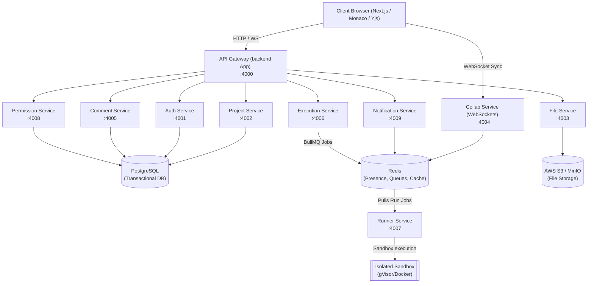

# 🖥️ Codex2 Backend Services

Welcome to the backend architecture repository of **Codex2**. The backend is built as a modular microservices monorepo using **NestJS** and structured to support horizontal scaling, containerized secure code execution, and real-time collaboration.

---

## 🛠️ High-Level Backend Architecture

The backend operates on a **Decoupled Microservices Design**, orchestrated through the root Nx Monorepo configuration.



### Communication Protocols
1. **Client-to-Gateway:** HTTPS / REST APIs for CRUD operations and WebSocket (`socket.io`) for real-time collaboration & terminal streaming.
2. **Service-to-Service (Synchronous):** High-speed NestJS Microservices TCP/gRPC layer for low latency RPC calls.
3. **Service-to-Service (Asynchronous):** Redis Pub/Sub for event broadcasting (e.g. notifications).
4. **Distributed Task Queue:** BullMQ (powered by Redis) for buffering code execution requests.

---

## 📂 Backend File & Directory Structure

```text
backend/
├── apps/                               # Monorepo NestJS Microservices
│   ├── auth-service/                  # Manages user identity, JWTs, and session lifecycles (Port 4001)
│   ├── backend/                       # API Gateway & Client reverse proxy entry point (Port 4000)
│   ├── collab-service/                # Real-time document sync via WebSockets + Yjs CRDTs (Port 4004)
│   ├── comment-service/               # Threaded code discussions and user @mentions (Port 4005)
│   ├── execut-service/                # Job verification & task ingestion into BullMQ queue (Port 4006)
│   ├── file-service/                  # Files/directories management and S3 metadata syncing (Port 4003)
│   ├── notification-service/          # In-app WS notifications, web push, and emails (Port 4009)
│   ├── permission-service/            # Granular RBAC and ACL policy verification (Port 4008)
│   ├── project-service/               # Projects, workspaces, and workspace profiles (Port 4002)
│   └── runner-service/                # Isolated execution processor running code in gVisor (Port 4007)
├── dist/                              # Target folder for production compilation output
├── .env                               # Local environment configurations (defines ports)
├── .gitignore                         # Git exclusion rules
├── .prettierrc                        # Prettier code formatting styles
├── eslint.config.mjs                  # Backend linting guidelines and static code analysis rules
├── nest-cli.json                      # NestJS Workspace definition mapping monorepo apps
├── package.json                       # Service-specific dependencies, scripts, and runtime engines
├── tsconfig.build.json                # TypeScript compilation config for production
└── tsconfig.json                      # TypeScript root compiler rules and path configurations
```

---

## 📦 Microservices Breakdown

### 1. API Gateway (`backend`) — Port 4000
Acts as the single point of entry for client web applications. It handles:
* Reverse-proxying API calls to correct downstream services.
* SSL/TLS termination, rate limiting (`@nestjs/throttler`), and request validation.
* Unified JWT decoding and validation before passing requests down.

### 2. Auth Service — Port 4001
Manages user authentication:
* Login, registration, OAuth2 providers (Google, GitHub), and JWT signing.
* Password hashing using Argon2.

### 3. Project Service — Port 4002
Handles workspace project lifecycle metadata:
* Creating, reading, updating, and deleting project profiles.
* Managing compiler/interpreter configurations for project environments.

### 4. File Service — Port 4003
Governs source code files and directories:
* Compiling nested directories into a flat tree structure.
* Persisting source code files in S3/MinIO objects or local disk storage.

### 5. Collab Service — Port 4004
Powers collaborative real-time editing:
* Handles active WebSocket links.
* Synchronizes documents collision-free using **Yjs** CRDTs.
* Tracks collaborative cursors and online presence within projects.

### 6. Comment Service — Port 4005
Manages codebase interactions:
* Links threaded comments to specific files, line indices, and character coordinates.
* Parses user `@mentions` and routes target alerts.

### 7. Execution Service — Port 4006
Ingests compilation and running tasks:
* Decides if run requests are structurally sound.
* Submits execution payloads to the Redis Job Queue (BullMQ).

### 8. Runner Service — Port 4007
Securely runs untrusted code:
* Consumes scheduled jobs from the Redis queue.
* Spawns sandboxed Docker containers (running under `gVisor`) with strict runtime limitations.
* Streams runtime console output (`stdout`/`stderr`) and exit codes back.

### 9. Permission Service — Port 4008
Evaluates authorization policies:
* Stores RBAC roles and ACLs.
* Checks if a user holds `Read`, `Write`, or `Execute` rights before service controllers process the request.

### 10. Notification Service — Port 4009
Central alerts dispatching hub:
* Receives event notices (like mentions or project invites) via Redis Pub/Sub.
* Sends real-time WebSocket notifications or falls back to email queues.

---

## 🚀 Running & Building Services

Make sure you are in the `backend/` directory to run these commands:

### Install Dependencies
```bash
npm install
```

### Start Services in Development Mode (with hot-reloading)
To launch the API Gateway (or any specific service, swap `backend` with the app name from `nest-cli.json`):
```bash
npx nest start backend --watch
```

### Production Build
Compile all applications to the `dist/` directory:
```bash
npm run build
```

### Linting and Formatting
Check and fix coding styles:
```bash
npm run lint
npm run format
```

### Run Tests
```bash
npm run test
```
