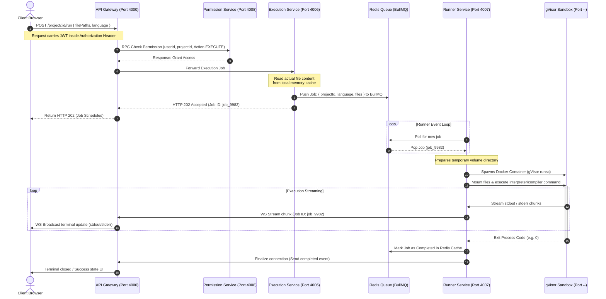
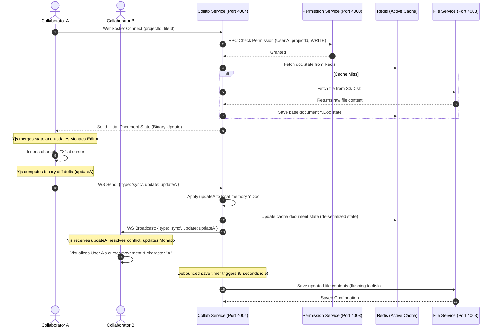
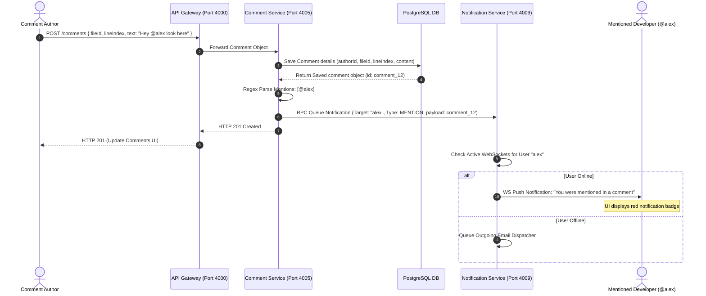

# Codex2: Application Data Flows

This document explains the step-by-step transaction sequences for critical user actions in the **Codex2** platform. These flows trace data across the frontend, gateway, downstream microservices, databases, and runner environments.

---

## 🏃 Flow 1: Safe Code Execution Workflow

When a user clicks the **"Run"** button in their browser, the system orchestrates authorization, queuing, sandboxed execution, and output streaming:

---

## 👥 Flow 2: Real-Time Collaborative Sync Flow

When multiple users are editing the same file, changes are synchronized conflict-free using CRDTs (**Yjs** protocol) over WebSockets:

---

## 💬 Flow 3: Inline Code Comment & Mention Dispatch

When a collaborator leaves an inline comment highlighting a line of code, the system processes database records and triggers notification dispatches:
 

